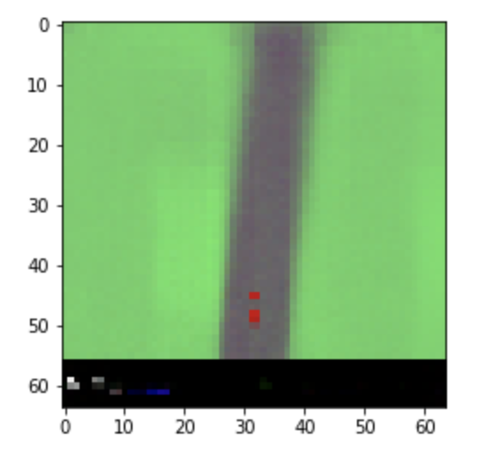
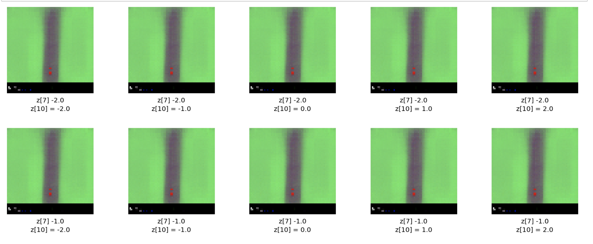
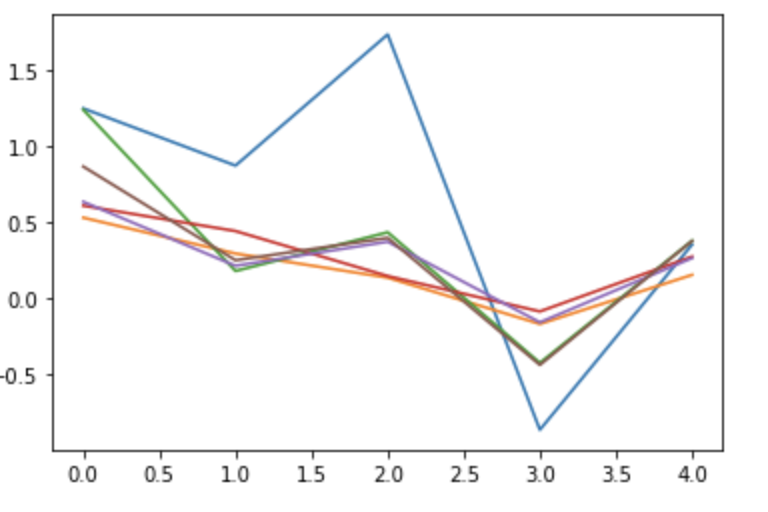
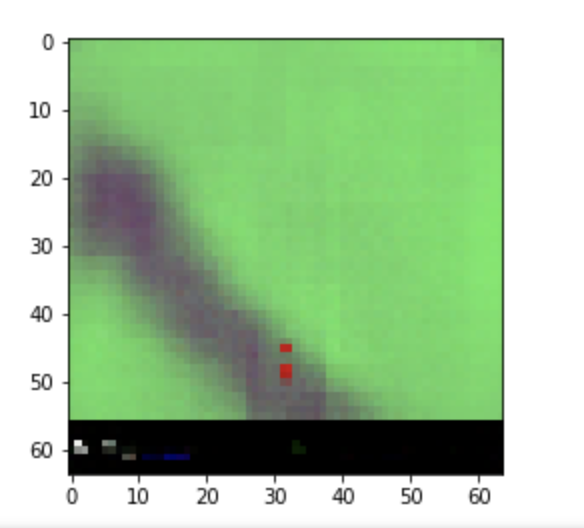
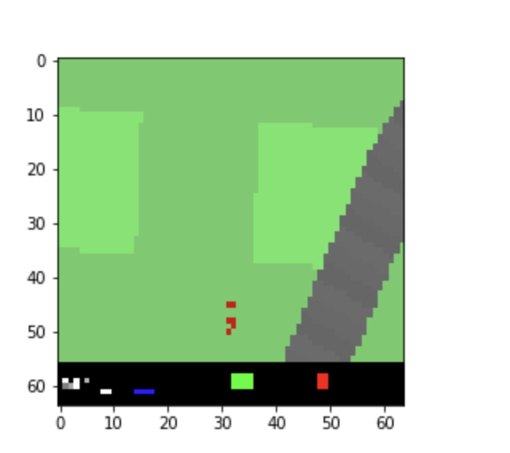
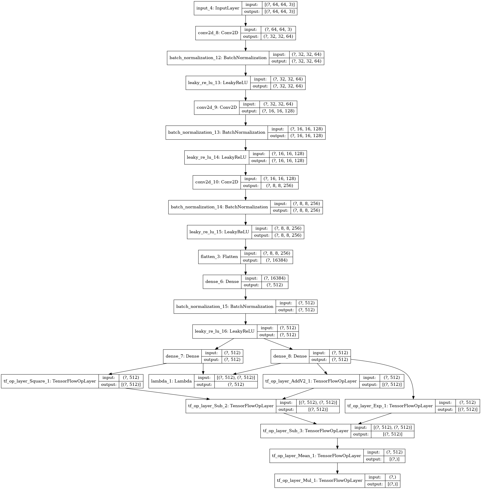
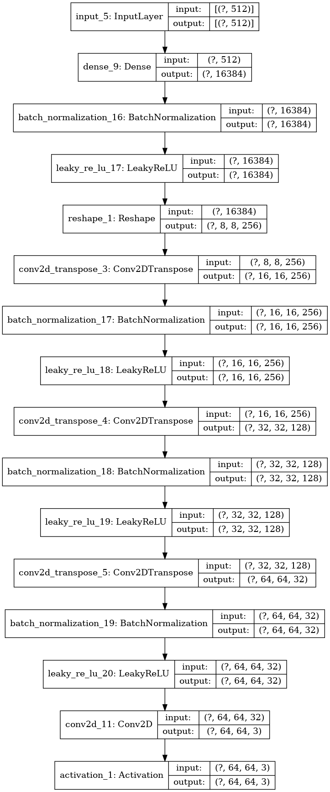
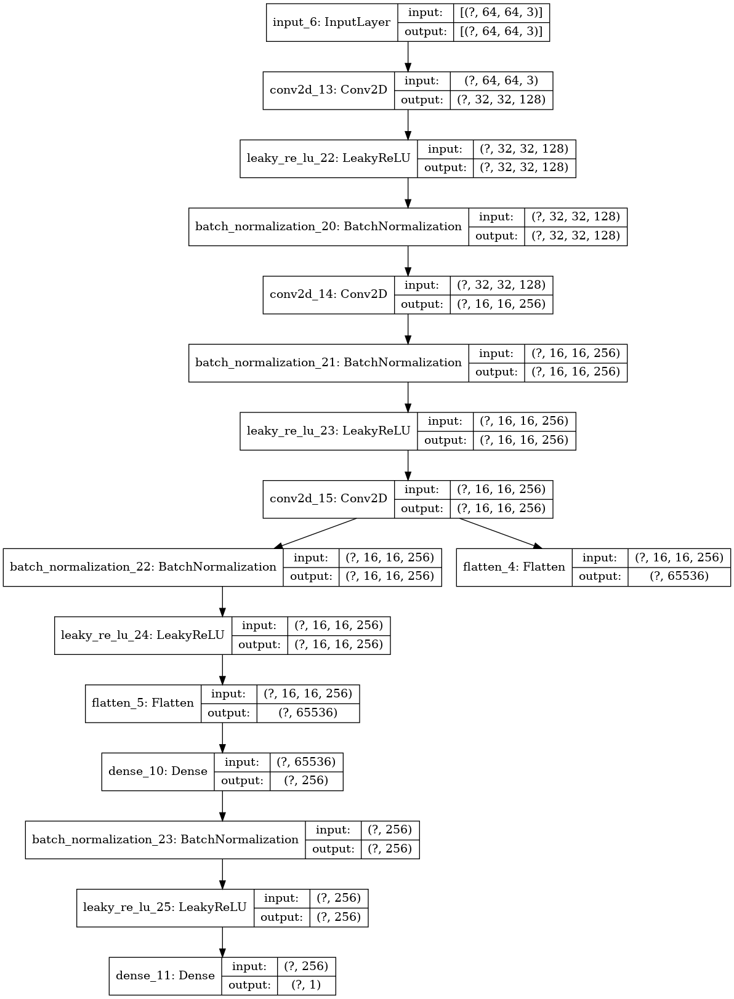
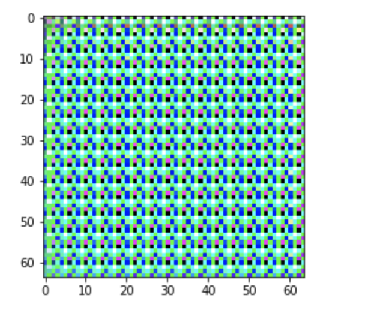

**World Model Project Report**

Yibei Huang, Shengwei Liang, Zhiyuan Li

sl8196,yh3655, zl3751

**1.Report** 

**Introduction to World Model**

World model is a generative neural network model of reinforcement learning. One of the key features of the world model is that WM can be trained quickly in an unsupervised manner to learn a compressed spatial and temporal environment. Another feature is that, by benefiting from the MDN-RNN model, the agent can be trained entirely inside of its own hallucinated dream world generated by its world model, which also has the capability of transferring into the actual world. 

The design concept of the World Model originated from the model model. Let's quickly explain the mental model first. A mental model is developed by humans, and it is based on the environment a human perceived with his or her senses. When a human perceives the world, a mental model is developed in his/her head. The mental model in our heads contains a series of information flows then our brain gains the abstract of the world that is around us. Also, we are interacting with the world based on the mental model in our head. This leads to another key idea that World Model based on. The decisions we made and actions we took are based on such internal models. The mental model is the foundation for human to predict the future. That is also why people could swing the baseball bat and hit the ball during an extremely small time window. Since, the batter predicted the future, (where and when the ball will come and in what direction) based on the mental model he perceived. Compared with the reinforcement learning problems, the artificial agent is now the batter, the representation of the past and present states we feed into the agent becomes his mental model, then the agent generates a predictive model of the future. As a consequence, we can use the artificial agent to “hit the ball”. 

**The key structure of World Model**

The main goal of the World Model is to use large neural networks to tackle RL tasks. Under such scenarios, the agent has been divided into two parts: one is the world model which is a large neural network in nature. The world model will learn the surrounding world of the agent in an unsupervised fashion. Now we see the task of world model, it is naturally to give the capability of vision to the world model. This is exactly how the world model was designed. The world model can also be divided into two components. First is the vision model (v) and the other one is the memory model (M). 

The vision model (V) is responsible to “see” the surrounding world. Even the task of the V model seems like solely observing the world, the actual role of V is not. The role played by the vision model is to abstract and compress the input, which is a series of 2D image frames. The structure of the V model is the Variational Autoencoder. A simple explanation of how the V model works is that, with a high-dimensional 2d image frame as input of V, the V model first encodes the frame and gives a middle output z, which is an encoded latent vector that represents the input frame. After getting the latent vector z, the V model will decode z to get a compressed and abstracted version of the input frame. The entire process is like a reconstruction of the input frame. 

A more detailed description of the vision model V would be as follows. The input image is high-dimensional. Thus the first step is to resize the image into a 64*64 pixels. The resized image also has RGB channels in a form of floating point between 0 and 1. In order to get the middle product latent vector z, we pass the resized input frame into ConvVAE. After feed into the ConvVAE, the input frame will pass four convolutional layers and finally became two low dimensional vector $\mu$ and $σ$. z is sampled based on $\mu$ and σ by applying Gaussian prior $N(\mu, σI)$. Now we got the middle product z. For image reconstruction, we simply pass z into another four deconvolution layers. 

For the memory (M) model, it is actually a MDN-RNN model. The concept of adding a M model is that we want to offer the World Model the capability of compressing what happens over time-predicting the future. However, predicting what? The M model is expected to predict the future z vectors that the V model produced. The aim is to handle the naturally stochastic complex environment, by output a probability density function p(z) instead of a terministic prediction of z. The approach behind the M model is Mixture Density Network combined with a RNN (MDN-RNN). The RNN segment of M model will model $P(z_{t+1}|a_t,z_t,h_t)$ , where $a_t$ is the action taken at time t and $h_t$ is the hidden state of the RNN at time t. The output of the RNN segment will go into the MDN segment. By taking the output of RNN and another uncertainty control parameter $τ$, the MDN gives a predicted $z_t$, it is the probability distribution of the next z. This $z_t$ will be passed to the next run of the M model as new input.  

We discussed the general structure of the M model, now lets see more details about it. The RNN segment of the M model is an LSTM recurrent neural network. In addition, as mentioned earlier, the outputted z is the probability distribution of the next t. However, a little point needs to be raised is that the outputted z is a diagonal covariance matrix of a factorized Gaussian distribution. Also, we would sample from this probability distribution function at each time step to generate the hallucinated environment. This would be a more detailed picture of the memory (M) model. 

The last component of the World Model is the controller (C) model. This controller is responsible for determining the course of actions to take. However, the C model is a very simple linear model that maps $z_t$ and $h_t$ to action $a_t$ at each time step: $a_t = W_c[z_t,h_t]$.In the controller model, a tanh nonlinearity is applied to clip and bound the action space to appropriate ranges. Also, the C model gets a feature vector as input, it consists of the z and the hidden state of the RNN in the M model. 

A key feature of the world model benefits from exploiting the M model. As mentioned before, the M model in producing the predicted distribution of the future states. If we generate the environment in future by applying the predicted distribution simultaneously when the model is training, then we can get a hallucinated environment. 

During the training phase, you may notice that the probability distribution from the M model will let the agent in the world keep encountering similar conditions. This condition will work fine in the simple cases. However, the behavior is poor in the complicated scenario. By reusing the M model’s loss function can help with such scenarios. The key is to flip the sign of the loss function. After doing that, the agent will be forced to face less common environments and improve the performance in the sophisticated cases. This is the key idea of the iterative training procedure. First initialize the M and C model with some random parameters, then rollout to the actual environment several times, during this phase, save all the actions taken by the agent and all the observations to storage. Next, train the M to model $P(x_{t+1},r_{t+1},a_{t+1},d_{t+1}|x_t,a_t,h_t)$.Last, iterate step 2 until it's done. The concepts behind the iterative training procedure has a high correspondence with the neuroscience ideas of memory consolidations. The important statement in memory consolidation is to repeat the same thing many times to reinforce the memory. As you can see in the iterative training procedure, the iteration parts plays the same role as in the memory consolidation. 

**The Key Concepts of World Model**

We have discussed the structure of the World Model, but there are still a few questions that need to be addressed in order to explain some concepts behind it. Why use RNN as the main component of V and M models? Why not use FNN or others? Why did the developers design the World Model in such a way? By answering that, a few points we have to mention. First of all, the main goal of the world model is not solving the problem with a small set of low dimension data. Instead, the world model is designed to put into a dynamic control world where the input is complex large high dimensional data, they are a sequence of raw pixel frames. The old works use Gaussian processes to deal with the system dynamics. However, this may work fine with low-dimensional input datas. For the scenarios the world model is facing, it is not enough anymore. So the world model used the Convolutional Variational Autoencoder (ConvVAE) model instead. ConvVAE is unlike normal autoencoders, the ConvVAE enforcing a Gaussian prior over the latent vector z. Although this may limit the amount of information capacity for compressing each frame, it also makes the world model more robust to unrealistic z vectors generated by the M model. This is why the world model is not using any FNN to take the current image frame to predict the next frame. This also uses FNN to train a fovea-shifting control network is not an option. The intuition is to avoid the difficulties of training a dynamical model to learn directly from high-dimensional pixel images, whereas to learn from an abstracted, and compressed representation of the frame. 

### Task 2:

We reproduced the result described in the paper, but unfortunately the limited space only allows us to generate 100 episodes of data. So we generated data three times and each time trained them with pre-trained weight. We finally have loss 40, reconstruction_loss 33 and kl_loss 7.67.

Here is one reconstruction of original image.

Then we trained our rnn with 100 episodes,  10 batch size and 10 steps, acquiring a loss of 1.22, 1.19 rnn_z_loss  and 0.03 rnn_rew_loss.

A graph of mu. The blue line is the actual reward and the others are predictions of the model. We can see that the prediction catched the right trend but not accurate enough.

Finally we trained the controller. However, after about 150 step, we only achieved an average of score 35, which is very low. We thought this is because the lack of number of data for rnn network. We tried to increase the learning rate of rnn but this did little to affect the controller training. Afterwards, we tried to manipulate the parameters inside the controller and that led to training disaster. Then results of the controller are shown below.

('improvement', 150, -0.9439750000000018, 'curr', 34.2998, 'prev', 35.243775, 'best', 35.243775)

Later we refined our rnn and vae with more data and trained the controll for over 1000 times. The results get better but still very low compared to the scores stated in the paper.

('improvement', 950, -17.8352, 'curr', 92.291425, 'prev', 110.126625, 'best', 110.126625)

When running experiments, the max total reward peeked at 110 and the car started to go in a circle and the reward started to decrease around 500 episodes.

### Task 3(part1)
The paper "Autoencoding beyond pixels using a learned similarity metric" introduced a method which combines a variational autoencoder with a generative adversarial network, so that we could  train our GAN discriminator(using image data) in a feature representation perspective instead of a pixel-wise perspective which could causes large error whereas a human would barely notice the change. The original VAE is consisting of an encoder and a decoder, and a GAN is consisting of a generator and a discriminator. In this paper, the author combines them together and create a VAE/GAN model has a form of a encoder connected to a decoder which replaced the generator of GAN and then connected to the discriminator. VAE/GAN is an unsupervised generative model and learns to encode, generate and compare dataset samples simultaneously. 

The advantage of this approach is that it produces better image sample compare to models trained with element-wise error measures, since it is trained with a more abstract, higher level and meaningful feature-wise metric and the training results in a image representation with distangled factors of variation. Since the traditional element-wise reconstruction errors and other signals with invariances are not enough for images, the author replaced the VAE reconstruction error with reconstruction error of GAN discriminator, since GAN learned rich similarity metric for images to discriminate them from "non-images" during the training. For the details of VAE, the encoding part which convert a data sample x into latent representation and decoding part which convert the latent representation back to data space are as follow: $z \sim { Encode}(x) = q(z|x),  \tilde{x} \sim Dec(z)=p(x|z)$. 

The regularization part is by using a prior over p(z) and $z \sim \N(O,I)$ is used. 

The loss function is summation of negative expected log-likelihood plus the prior which is $Loss^{pixel}_{like}+Loss_{prior}$ respectively: 

$Loss^{pixel}_{like} = -E_{q(z|x)}[log\frac{p(x|z)p(z)}{q(z|x)}], Loss_{prior}=D_{KL}(q(z|x)||p(z))$. 

$D_{KL}$ is Kullback Leibler divergence. For the GAN, the generator maps latent representation from VAE to data space and discriminator assign a probability $y=Dis(x)\in [0,1]$, x is the actual data sample and for 1-y, x is the data generated by Gen(z). The loss function is expected to minimize the cross entropy and designed as: 	$Loss_{GAN}=log(Dis(x)+log(1-Dis(Gen(z))))$. 

But all the equation above is used in traditional model and in the VAE/GAN model we combined two models together which make the element-wise reconstruction errors no enough to train the model, hence the author introduced a Gaussian observation model for $Dis_l(x)$ with mean $Dis_l(\tilde{x})$:

 $p(Dis_l(x)|z)=N(Dis_l(x)|Dis(\tilde{x}),I)$ , where $l$ is the layer number and $\tilde{x} \sim Dec(z)$ is the sample from the decoder of x.

 So finally we are going to replace the VAE(pixel-wise) error with  $Loss^{Dis_l}_{like} = -E_{q(z|x)}[log (p(Dis_l(x)|z))], Loss_{prior}=D_{KL}(q(z|x)||p(z))$ and train the model with the combined method $Loss=loss_{prior}+loss_{like}^{Dis_l}+loss_{GAN}$. 

The author also observed some problems during the development and tried to make three adjustment: 

1. Limiting error signals to relevant networks, since they found that they would get better result by not backpropagating the error signal from $loss_{GAN}$ to Enc. 
2. Weighting VAE v.s. GAN, they introduced a parameter $\gamma$ on $loss_{like}^{Dis_l}$ instead of applying it on entire model. 3. Discriminating based on samples from P(z) and q(z|x). For this project, we are going to mimic the way how author combines AVE and GAN  together in the world models, and take advantage of practice adjustments given by author according to our situation.

### Task 3(part2)

We implemented a combonation of vae and gan in file vaegandemo.py. The whole network consists of an encoder, a generator and a discriminator. We changed the whole structure from the previous task and add batchnormalizatoin as well as relu to each layer of cnn. The program can train the three weights succussfully but the output is not promising. As a result, the output of a particular frame has the same color theme but more like a random noice. I checked the weights generated by the model and find out the all the weight is around 0.5 even if I trained for more steps and increase the learning rate. The weights are stored in save_model folder and the reconstruction image is as follows.

First we tried to use the previous design and combine encoding, generator and discriminator into one big model, but in this way it is very hard to rewrite the loss function for each step. The gradient appears to be vanished in this model(vae/vaegan.py). So we tried out a new infrastruture as below.

The structure of VAEGAN model(vaegandemo.py). Instead of encoding image into [32,] vectors, we made it a [512,] vectors

Then the resulting vector will be put into a generator. The structure of the generator was shown below. 

The image generated by the generator will then be put into a discriminator to make a classification and produce a probability of whether this image is the original image.

The result of previous vae reconstruction image and the VAEGAN model.

We both found it a very interesting topic and will definately dig in more about it. Especially DQN is used very often in real world auto-pilot and vehicles.

### References:

Leo Heidel, 2020 https://github.com/leoHeidel/vae-gan-tf2

